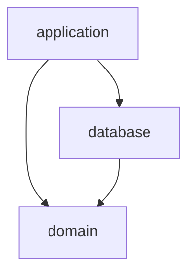
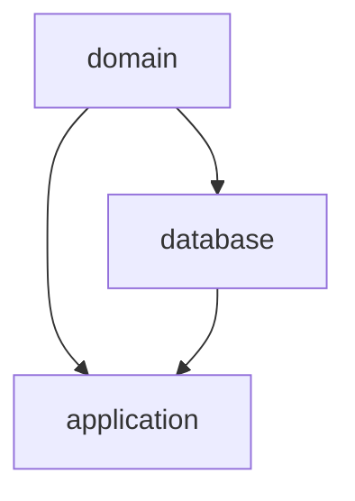
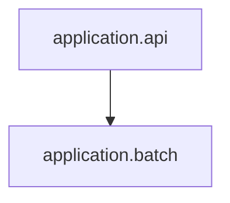

<!-- 템플릿 사용 방법은 HELP.md를 확인해주세요. -->
<!-- TODO(template): 주석을 보고 적절한 값으로 치환 후 주석을 제거해주세요.-->
## spring-multi-module-template <!-- repo 이름으로 변경해주세요. -->
<!-- 해당 repo와 역할과 책임을 간략히 적어주세요. -->

### 환경별 주소
<!-- 배포 후 서버에 접근할 수 있는 주소를 환경별로 명시해주세요. -->

| env   | url |
|-------|-----|
| prod  |     |
| dev   |     |
| stage |     |

### Dependency Rule
- application
    - domain과 database에 의존할 수 있습니다.
    - 모듈 내에 존재하는 모듈끼리는 서로 의존하지 않아야 합니다.
- database
    - domain에 의존할 수 있습니다.
    - repository를 구현하지 않습니다. repository는 각 필요에 따라 application 모듈에서 정의됩니다.
    - entity를 정의하고, entity와 domain간의 매핑도 정의합니다.
- domain
    - 독립적이며 다른 모듈에 의존하지 않아야 합니다.
    - 비즈니스 로직을 담은 도메인 클래스를 정의합니다.

> good :+1:

> don't :-1:

### how to deploy
<!-- 배포 후 방법이 변경된 경우 직접 명시해주세요. -->
[커머스 서비스 배포 workflow](https://www.notion.so/ohousebackend/4b5cb05859e346459fe20476d0cea4b7) 를 따릅니다.
